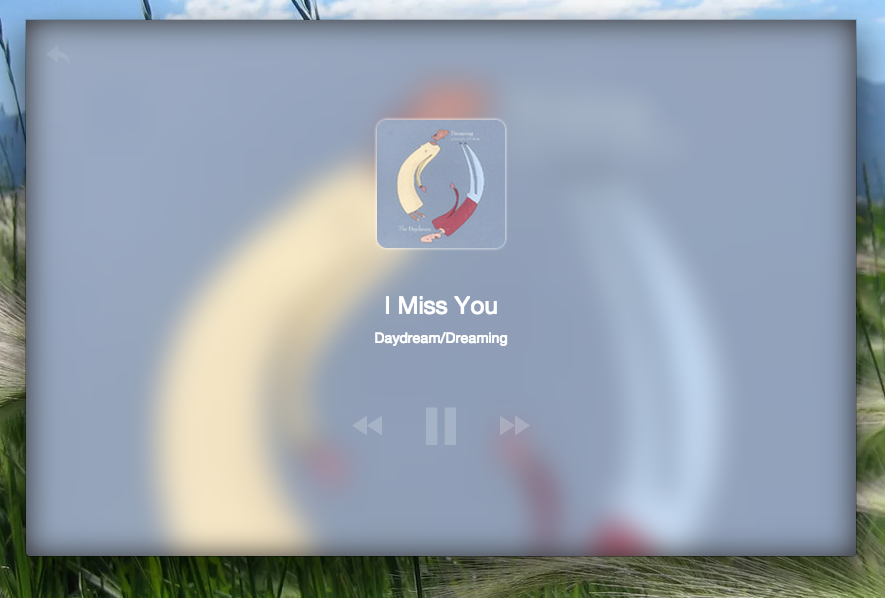
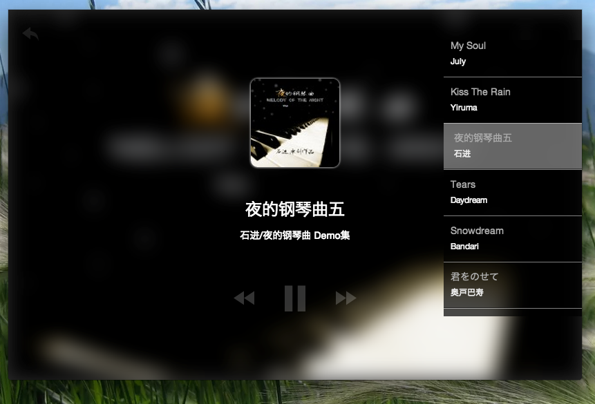

##随听

###基于node-webkit 利用各大音乐网站api，目前只完成虾米音乐部分！

###安装
1. 首先从 [官方下载](https://github.com/rogerwang/node-webkit) node-webkit框架
2. 把代码放入node-webkit，运行
3. 以后会放出 打包好 链接！

___

####note:

_还没有对程序打包，所以pc下暂时无法使用。_

_框架用的jquery，后期完成后会改成angularjs_

_这段忙，一直没更新，以后有时间会陆续加上网易，和qq音乐，交互也需要在优化，现在只实现简单的播放_

